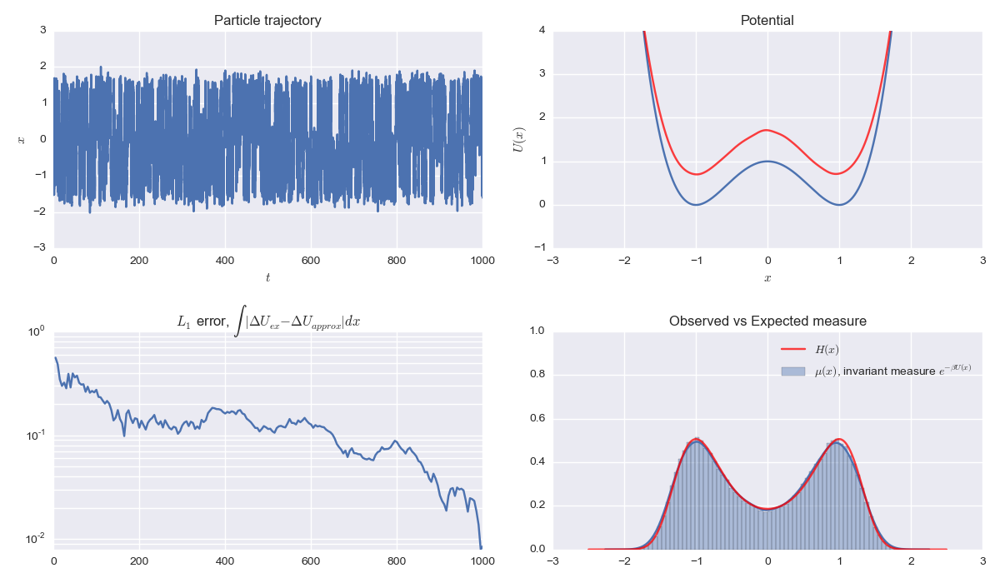

+ **Model**: [Overdamped Langevin dynamics](http://en.wikipedia.org/wiki/Langevin_dynamics) in a double well potential
+ **Integrator**: [Euler-Maruyama SDE](http://en.wikipedia.org/wiki/Euler-Maruyama)
+ **Metric**: Energy barrier (exact versus estimated)
+ **Author**: [Travis Hoppe](https://github.com/thoppe)_

This is the initial setup of the toy problem of the symmetric double well potential, with a barrier height of 1kT.

The simulation shows a naive way of calculating the enthalpy energy barrier, simply let the system evolve. The particle feels both Brownian motion and the underlying potential, and hence it samples the invariant measure of exp(-U(x)/kT). The enthalpy energy barrier is estimated on both sides and compared to the exact value, and the error term is the L1 average of these differences.

Shown below is a sample trajectory, the estimated potential, the error and the observed versus expected visits to each position. While the estimated potential has a large absolute error, the energy difference between the two wells converges rapidly since the potential is simple.

