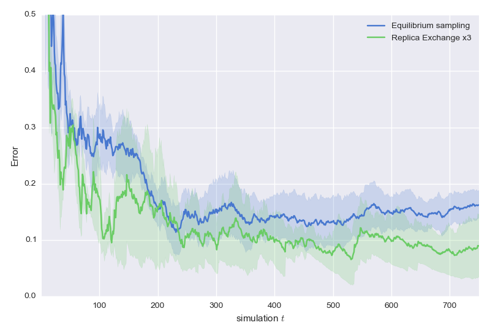

+ **Model**: [Overdamped Langevin dynamics](http://en.wikipedia.org/wiki/Langevin_dynamics) in a double well potential
+ **Integrator**: [Euler-Maruyama SDE](http://en.wikipedia.org/wiki/Euler-Maruyama)
+ **Metric**: Energy barrier (exact versus estimated)
+ **Author**: [Travis Hoppe](https://github.com/thoppe)

This is the initial setup of the toy problem of a symmetric double well potential, with a barrier height of 1kT. 
The particle feels both Brownian motion and the underlying potential, and hence it samples the invariant measure of exp(-U(x)/kT). 
The energy barrier is estimated on both sides and compared to the exact value, and the error term is the L1 average of these differences.

+ **Sampling Algorithm**: None

The simulation shows a naive way of calculating the energy barrier, simply let the system evolve. 
Shown below is a sample trajectory, the estimated potential, the error and the observed versus expected visits to each position. 
While the estimated potential has a large absolute error, the estimated energy difference between the two wells converges quickly since the potential is simple.

The simulation can be repeated by running:

    python alg_EnergyBarrier_equilibrium.py simulation_setups/example_EnergyBarrier.json

Where the configuration file [example_EnergyBarrier.json](simulation_setups/example_EnergyBarrier.json) is given by (TO DO: Comment on parameters):

    {
    "kT": 1.0,
    "friction_coeff" : 0.1,

    "dt" : 0.0001,

    "simulation_time": 2000,
    "metric_check"   : 10000,
 
    "SIM_metric_func": "average_activation_energy",
    "f_results": "results/example_EnergyBarrier_r{replica_n}.txt",

    "show_plot" : false
    }

+ **Sampling Algorithm**: Replica Exchange

The simulation can be repeated by running:

    python alg_EnergyBarrier_replicaEx.py simulation_setups/replicaEx_EnergyBarrier.json

In addition to the parameters set by the simple sampling algorithm, the following options are accepted:

   {
    "kT_list" : [0.8,0.9,1,1.1,1.2],
    "exchange_steps" : 30000,
   }

## Results

The results of the sampling algorithms are shown below:

