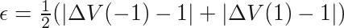
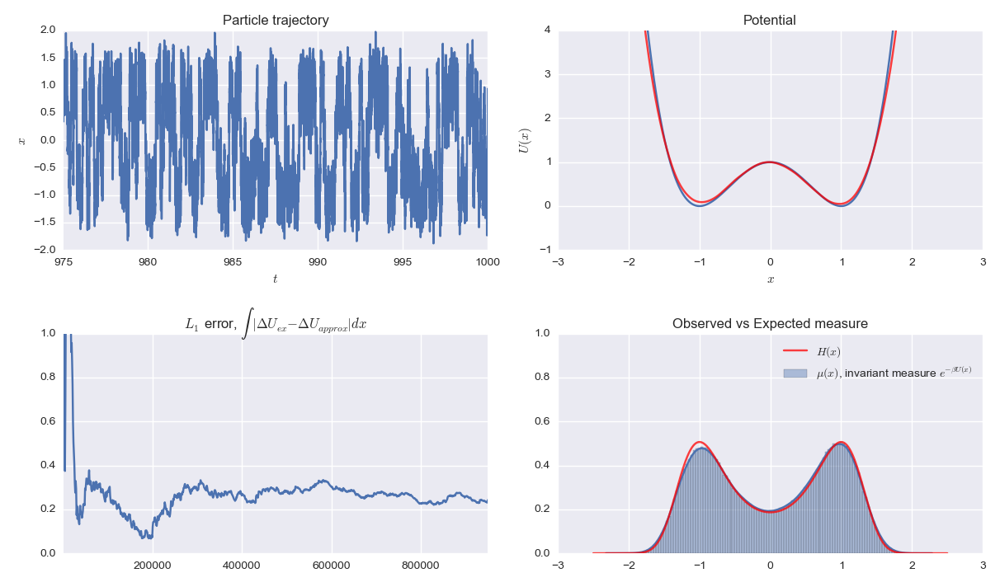

# Double well

+ **Model**: [Overdamped Langevin dynamics](http://en.wikipedia.org/wiki/Langevin_dynamics) in a double well potential
+ **Integrator**: [Euler-Maruyama SDE](http://en.wikipedia.org/wiki/Euler-Maruyama)
+ **Author**: [Travis Hoppe](https://github.com/thoppe)

This is the initial setup of the toy problem of a one-dimensional symmetric double well potential, with a barrier height of 1kT. The potential energy is:

<p align="center" class="mdequation"></p>

The motion is overdamped and stochastic, hence the instantaneous momentum is simply a combination of Brownian motion and the underlying potential.
The system evolves according to the [stochastic differential equation](http://en.wikipedia.org/wiki/Brownian_dynamics):

<p align="center" class="mdequation"></p>

where zeta is the frictional coefficient times the mass and W is a delta-correlated stationary Gaussian process with zero-mean (simulating random thermal motion). 
Given enough time, the trajectory of the particle samples the the invariant measure

<p align="center" class="mdequation"></p>

The following codes require the python libraries [`numpy`](www.numpy.org) and [`scipy`](www.scipy.org) to compute and [`matplotlib`](matplotlib.org) and [`seaborn`](https://github.com/mwaskom/seaborn) to plot.

## Metric: Energy Barrier

The energy barrier is estimated on both sides and compared to the exact value.
The error term is the L1 average of these differences.

<p align="center" class="mdequation"></p>

Here V(x) is the estimated potential and \Delta V(x) measures the difference from x to the top of the well.
Given a histogram H(x), that records the number of visits to each state one can estimate the potential as

<p align="center" class="mdequation"></p>

The histogram can be a simple bin, or alternatively one can use a kernel density estimation on the entire trajectory. For now, we used a binned histogram for the computations.

#### Results: Energy Barrier

The results of the sampling algorithms are shown below:


After running the simulations, this plot can be reproduced by running

    python src/plots_results.py

Note: This does not properly scale the time needed for replica exchange yet.

**Sampling Algorithm**: [Equilibrium](method_equilibrium.py)

The simulation shows a naive way of calculating the energy barrier, simply let the system evolve. 
Shown below is a sample trajectory, the estimated potential, the error and the observed versus expected visits to each position. 
While the estimated potential has a large absolute error, the estimated energy difference between the two wells converges quickly since the potential is simple.



The simulation can be repeated by running:

    python method_equilibrium.py simulation_setups/equilibrium_EnergyBarrier.json

or simply:

    make sim_equilibrium

The configuration file [`equilibrium_EnergyBarrier.json`](simulation_setups/equilibrium_EnergyBarrier.json) sets the system parameters:

```JSON
{
    "kT": 1.0,
    "friction_coeff" : 0.1,
    "dt" : 0.001,

    "simulation_time": 800,

    "metric_check"   : 1000,
    "warmup_steps"   : 50000,
 
    "SIM_metric_func": "activation_energy",
    "f_trajectory"   : "trajectory/equilibrium_EnergyBarrier_r{replica_n}.txt",
    "f_results"      : "results/equilibrium_EnergyBarrier_r{replica_n}.txt",

    "histogram_bins" : 1000,
    "histogram_min"  : -2.5,
    "histogram_max"  :  2.5,

    "show_plot" : false
}
```

With `show_plot` set to `true` the trajectory plot above is reproduced. 

**Sampling Algorithm**: [Replica Exchange](method_replicaEx.py)

The simulation can be repeated by running:

    python method_replicaEx.py simulation_setups/replicaEx_EnergyBarrier.json

or the shortcut

    make sim_replicaEx

In addition to the parameters set by the equilibrium sampling algorithm, the configuration file [`replicaEx_EnergyBarrier.json`](simulation_setups/replicaEx_EnergyBarrier.json) highlights two new options available:

```JSON
{
    "kT_list" : [0.2,0.5,1.5],
    "exchange_steps" : 30000,
}
```


